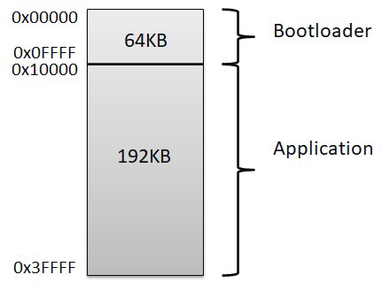
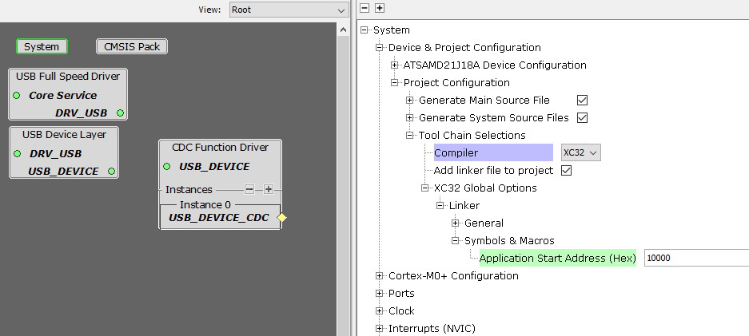

# Microchip Touch Bridge Bootloader
When Bootloader mode is selected (Refer to [Mode Selection](../readme.md#Mode-Selection)), the USB enumerates as a standard USB Flash drive. It is possible to upgrade the application firmware by dragging and dropping the application .hex file.

[Bridge Application Readme](readme_bridge.md)

## Flash Memory
The memory between Application and Bootloader is split as follows.

## Preparing Application Firmware
When dropping the application firmware, the application must be built with ROM region starting address set at 0x10000. If the ROM Starting address is not set properly, then the programming will not work correctly.
Select the starting application address in H3 to 0x10000 in “system” component as follows:

## Firmware Components
Bootloader firmware uses the following primary modules.
* USB Mass Storage Device (MSD) Class
* Hex Parser
* Virtual File System
* Drivers
  * SERCOM UART for Bluetooth (General information)
  * NVMCTRL

## Debug output
In Bootloader mode, the device sends various debug information on Bluetooth COM PORT. The baud rate is 115200.

